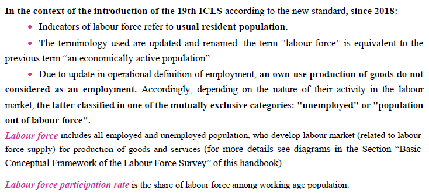
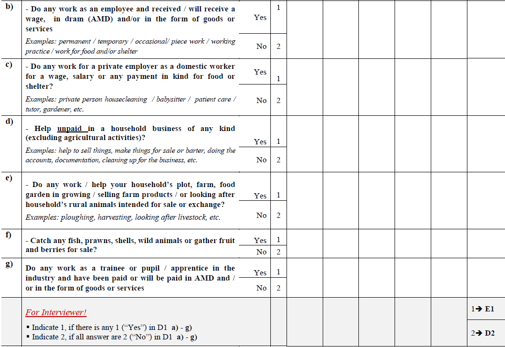
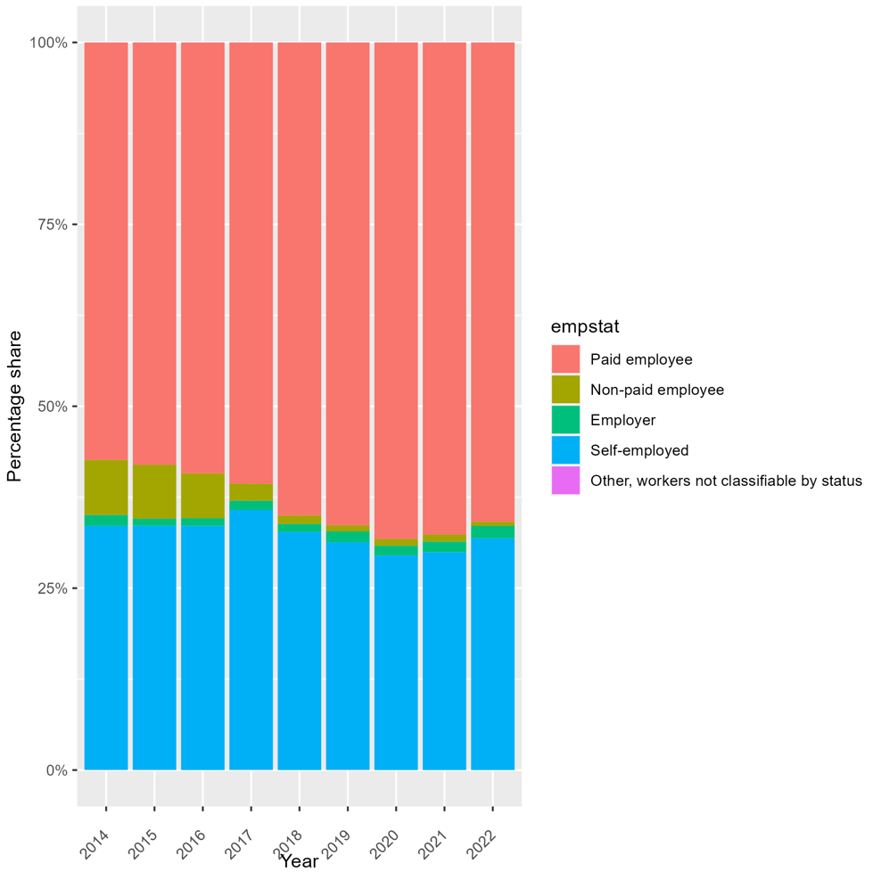
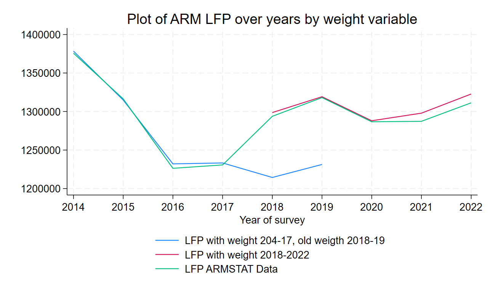
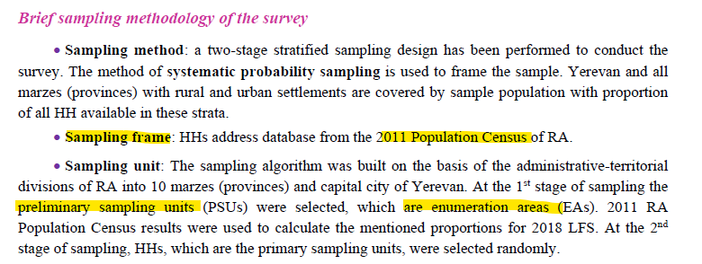
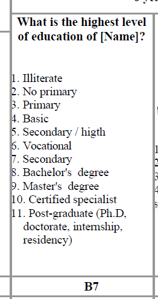
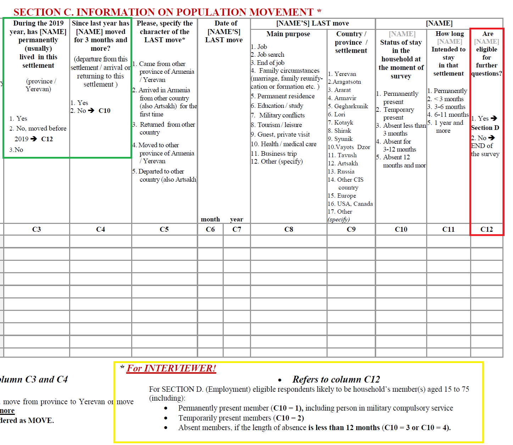
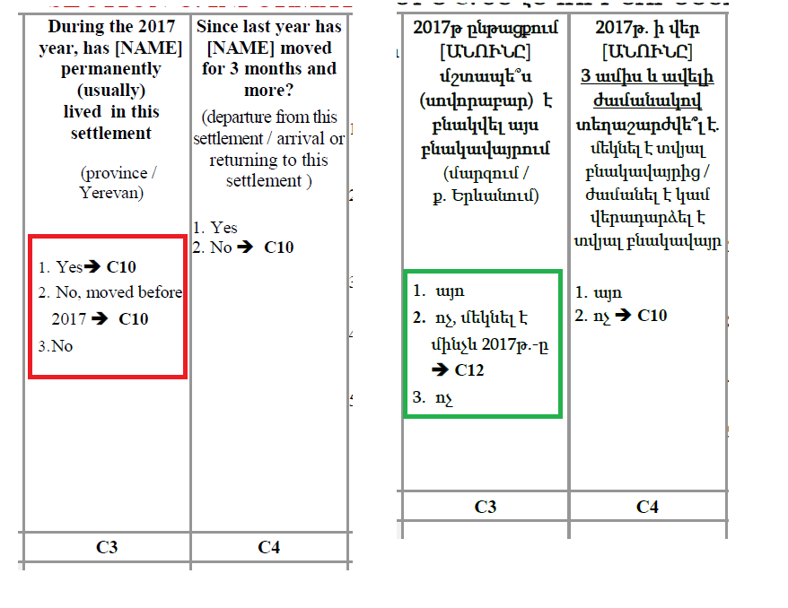

# Introduction to Armenia (ARM) national Labour Force Survey (LFS)

- [What is the ARM LFS](#what-is-the-arm-lfs)
- [What does the ARM LFS cover?](#what-does-the-arm-lfs-cover)
- [Where can the data be found?](#where-can-the-data-be-found)
- [What is the sampling procedure?](#what-is-the-sampling-procedure)
- [What is the geographic significance level?](#what-is-the-geographic-significance-level)
- [Other noteworthy aspects](#other-noteworthy-aspects)

## What is the ARM LFS?

The Armenian Labour Force Survey (LFS) is a household-based sample survey conducted by the National Statistical Service (NSS) of the Republic of Armenia. Before 2014, the Households Integrated Living Condition Survey played the central role of providing labour market statistics. Since 2014, the ARM LFS was conducted monthly every year with the aim to measure the levels and trends of employment, unemployment, and labour force in Armenia. 

## What does the ARM LFS cover?

The ARM LFS findings provide annual and quarterly short-term labour market statistical indicators. In addition to general household characteristics, the LFS covers indicators such as the country labour resources, or working age population (aged 15 to 75), by gender, age, education and family statues; active and inactive population in labour market by various characteristics; employment in different economic sectors, working hours and incomes etc. The ARM LFS includes migration information since 2018. 

The ARM LFS covers all 11 marzes (provinces) and both rural and urban settlements. The survey is run continuously through the month (i.e., sample size per month is roughly 1/12th of annual sample size).

It covers residents of private households. The residents of the retirement homes, prisons
and other institutional households are not surveyed.

Between 2014 and 2017 residents absent from the household for more than three months were not included in the survey (i.e., present respondent requested not to reply in their name). From 2018 onwards this was extended to 12 months (i.e., details on a person absent for 8 months are included).

GLD harmonization of ARM LFS covers years from 2014 to 2022 continuously, 9 years in total. Years and their corresponding sample sizes of LFS harmonized are:

| **Year**	| **# of Households**	| **# of Individuals**	| **Expanded Population**	| **Officially Reported Sample Size(# HH)**	| 
| :------:	| :-------:		| :-------:	 	| :-------:	 	| :-------:	| 
| 2014 | 7,679         | 29,453      |  3,087,669  |   7,680   |
| 2015 | 7,788         | 29,662      |  3,023,842  |   7,788   | 
| 2016 | 7,788         | 28,516      |  2,895,298  |   7,788   | 
| 2017 | 7,783         | 28,463      |  2,927,886  |   7,788   | 
| 2018 | 7,788         | 28,296      |  2,908,921  |   7,788   |
| 2019 | 7,768         | 27,854      |  2,839,777  |   7,788   | 
| 2020 | 7,781         | 27,986      |  2,961,467  |   7,788   |
| 2021 | 7,776         | 26,923      |  2,962,306  |   7,788   | 
| 2022 | 7,760         | 27,218      |  2,969,037  |   7,788   | 
| 2023 | 7,707         | 27,007      |  2,964,345  |   -,---   | 

(*Note: The officially reported sample sizes are from methodology documentation of each year, which can be found from the [online publication library of NSS](https://armstat.am/en/?nid=82&year=2013).*)  

## Where can the data be found?

All data is publicly available on the website of [Statistical Committee of the Republic of Armenia] ([http://nada.nso.gov.lk/index.php/home](https://armstat.am/en/?nid=212)). As mentioned above, each year's corresponding documentation on employment and other estimates can be downloaded without any restrictions from their online publication library.

## What is the sampling procedure?

A two-stage stratified sample by regions (marzes) has been designed to conduct the survey. The method of systematic probability sampling was used to frame the sample. Yerevan and all marzes with rural and urban settlements were covered by sample population with proportion of all households available in these strata. Based on the administrative and territorial division of ARM at the first stage of sampling, the preliminary sampling units, i.e. enumeration areas were selected. At the second stage of sampling, the PSU or households, were randomly selected.  

## What is the geographic significance level?

According to the [methodology section](utilities/ARM_2018_methodologies.pdf) in ARM LFS annual reports, the annual size of the sample in terms of aggregated indicators (e.g. unemployment, employment, etc.) provides high representativeness on country level, and provides minimum representativeness on marz (province) level.

The 2018 methodology states that any estimated population group with a weighted population of fewer than 7’500 individuals will have limitations of reliability and need to be used with care.

## Other noteworthy aspects  

### Changes in International Conference of Labour Statisticians (ICLS) version and its impact on results  

The ARM LFS went through a change between 2017 and 2018 in its questionnaire structure and the ICLS version applied which accordingly changed some of the questions surveyed. From 2014 to 2017, the ARM LFS used ICLS-13, meaning that working for own consumption is defined as employed. The change in the definition is documented in the employment section of [2017](utilities/ARM_2014-2017_employment_definition.pdf) and [2018](utilities/ARM_2018_employment_definition.pdf)'s annual reports. The table below shows the difference in the official explanations (top half) and employment blocks in the 2017 and 2018's questionnaires (lower half). Note the difference in the phrasing of question e) - you may click on the images to render them more legible.  

  
|  **2014-2017**	|  **2018-2023**	| 
| :-------------:	| :------------:	|
| |  | 
| |  |

  

This change leads to an apparent decrease in non-paid employees after 2017.

  

In addition, kindly be advised that it is not feasible to convert between different ICLS versions in ARM LFS. Although the questionnaire screenshots above show that the employment status is composed by several sub-questions in terms of "for-sale" and "for-own-consumption" work, the raw datasets only present the final decision about whether a given observation is employed or not based on their answers to the sub-questions which we couldn't see. Therefore, we were not able to convert between ICLS-13 and ICLS-19 by "switching on and off" the "for-own-consumption jobs".  

### Changes to the weight variable

At the same time as the change of employment definition was implemented, a change in the weight calculation was also introduced. From 2018 onwards a new weight (referred in the raw data as "_calibrated_") is used. This value results in a higher extended population. during 2018 and 2019 both the old weights (used in 2014 to 2017) and the calibrated weights (used since 2018) are available in the raw data. 

The GLD harmonization includes by default the calibrated weights as the standard weights (variables `weight` and `weight_q`). For the years 2018 and 2019 the old weights are kept in special variables (i.e., not part of the common GLD dictionary) called `weight_old_series` and `weight_q_old_series`.

The graph below plots the labor force participation using the old series (blue line) and the new weights (red line). Additionally, the green line denotes the data as reported by the Armenian NSO. The change in employment definition should decrease LFP as own consumption workers are no longer employed. This is only visible with the old weights, as the new weights increase the population that indicates a positive jump in the labor force participation (LFP)

Users are advised to take these changes into account when trying to create a series over all LFS years. The code to produce the above graph [can be found here](utilities/Comparison_weights.do).

### Coding of industry and occupation codes

In terms of classifications of industry and occupation, ARM LFS used ISIC-4 and ISCO-08 respectively for all years. No national classifications applied. 

However, regarding the level of classification, both industry and occupation only used the first level disaggregation, that is Major Units for occupation (numbers 0-9) and Sections for industry (letters A to U). The full lists of industry and occupation labels are covered in this [separate document](Classifications_of_Industry_and_Occupation.md). 

### Coding PSU and strata

Based on the description of sampling methodology in the annual report of 2018 (refer to the screenshot below), the sampling is based on the 2011 census. The PSUs are census enumeration areas to which we currently do not have access. In this case, we didn't code `psu` in GLD. We may update this variable in the future if information concerned becomes available.   

### Age restriction of the questionnaire labor market module

While most surveys limit the market module to all people aged above lower age threshold (commonly 15 years of age), the Armenian ILCS is limited also by an upper age threshold. Only people aged 15 to 75 respond to the labor market module and thus have labor variables. Given the low labor force participation of people aged 76 and older, it can be assumed that the labor force participation of the population 15+ is lower than the one that can be calculated.

### Coding of education

The Armenian education system has a 4 + 5 + 3 structure where the first four years represent primary, the middle five years general secondary, and the latter three upper secondary.

Particular to Armenia are the different paths and academic levels of vocational training, some requiring upper secondary education, others available to graduates of general education.

[This UNESCO website](https://unevoc.unesco.org/home/Dynamic+TVET+Country+Profiles/country=ARM) summarises the (current) education situation in Armenia, including tertiary education.

The coding of the GLD variable `educat7` uses the questionnaire variables shown below (coding of years 2014 to 2017 on the left, codes since 2018 on the right.

| Questionnaire (2014-17)     | Questionnaire (2018-) | 
|------------------|-----------------------|
|    |   | 

With this information, the coding choice is shown below. The key distinction is between the basic vocational training, which is seen as equivalent to finishing secondary education and more advanced forms of vocational training, that site between secondary and tertiary education.

| Questionnaire 2014-2017                                    |                                            | | Questionnaire since 2018                                   |                                            |
|------------------------------------------------------------|--------------------------------------------|-|------------------------------------------------------------|--------------------------------------------|
| ARM LFS Question B15                                       | GLD educat 7                               | | ARM LFS Question B7                                        | GLD educat 7                               |
| 1. Illiterate                                              | 1 No education                             | | 1. Illiterate (No education)                               | 1 No education                             |
| 2. No primary                                              | 2 Primary incomplete                       | | 2. No primary                                              | 2 Primary incomplete                       |
| 3. Primary                                                 | 3 Primary complete                         | | 3. Primary                                                 | 3 Primary complete                         |
| 4. Basic                                                   | 4 Secondary incomplete                     | | 4. Basic                                                   | 4 Secondary incomplete                     |
| 5. Secondary                                               | 5 Secondary complete                       | | 5. Secondary (high school)                                 | 5 Secondary complete                       |
| 6. Vocational                                              | 5 Secondary complete                       | | 6. Vocational (lower level)                                | 5 Secondary complete                       |
| 7. Secondary specialized                                   | 6 Higher than secondary but not university | | 7. Specialized vocational training (higher level)          | 6 Higher than secondary but not university |
| 8. University                                              | 7 University incomplete or complete        | | 8. Bachelor's degree                                       | 7 University incomplete or complete        |
| 9. Post-graduate                                           | 7 University incomplete or complete        | | 9. Master's degree                                         | 7 University incomplete or complete        |
|                                                            |                                            | | 10. Certified specialist                                   | 7 University incomplete or complete        |
|                                                            |                                            | | 11. Post-graduate (Ph.D, doctorate, internship, residency) | 7 University incomplete or complete        |
                                                                                                                                   

### Age variables in 2021 and 2022

Different from previous years, the last two years, 2021 and 2022 do not have the actual age of each observation in the raw dataset. Instead, age is coded in 16 age groups (see screenshot from 2022 below).

  

In this case, we harmonized our `age` variable using the mean of each sub-group of the original `Age_16groups` so as to proceed with our quality checks which require numeric values (i.e., all people between 0 and 4 are coded as 2 year olds, all 65 to 69 are coded as 67). Hence, for 2021 and 2022, `age` in GLD harmonization of ARM LFS does not represent the actual age of a given observation. Yet instead, it indicates the age group a given observation belongs to. 

### Absent household members

Armenia's LFS includes in the general information about the household all members the household deems to be part of it. However, many of the people the household emotionally may list as its members are absent (e.g., a child who has left for work in another country) and thus are not to be included. 

The logic in the questionnaires from 2014 to 2017 is to have the enumerator skip any members who have been absent for 3 or more months (except for military service), as shown below.

From 2018, a special section (section **C**) is introduced to collect more information on absent household members and determine their exclusion. Their general status is determined in questions C3 and C4 (green box in the screenshot below), their eligibility is determined in question C12 (red box) following the parameters outlined below (yellow box). 

The above screenshot is from the 2019 questionnaire and questions as well as instructions change slightly over the years. In 2022, all people aged 2022 are coded as eligible, even though 253 individuals claim that they have not usually resided in the household in the previous year (C3 == 2) and have been absent for at least 3 months (C10 == 4  or 5).

Users are advised to review the logic and take into account how it may impact any calculation of the working age calculation (as absentees are present in the data even though they lack labor module answers). Finally, users are also advised to review the translations as there may be errors in the English translation. The only error in this section we have found is shown below, where the English translation has a different skip pattern to the Armenian version.

  

