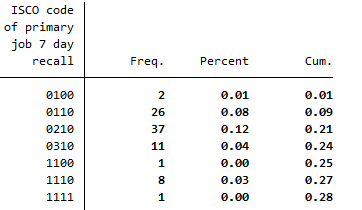

Introduction to the Bolivian Continuous Employment Survey (ECE) 
================

- [What is the BOL ECE?](#what-is-the-bol-ece)
- [What does the BOL ECE cover?](#what-does-the-bol-ece-cover)
- [Where can the data be found?](#where-can-the-data-be-found)
- [What is the sampling procedure?](#what-is-the-sampling-procedure)
- [What is the geographic significance level?](#what-is-the-geographic-significance-level)
- [Other noteworthy aspects](#other-noteworthy-aspects)

## What is the BOL ECE?

Since 2015 (Q4), the Bolivian National Statistics Institute (INE) carries-out the ECE. The survey goal is to collect national data to develop better labour indicators. The ECE gathers national, rural and urban data for unemployment, labour supply, and migration. 

## What does the BOL ECE cover?

The ECE covers national, urban and rural data from nine "departmentos" (subnational level 1). Information is available at the national, household and individual level.

*Table 1. Observations per year* 
| Year	    | # of Households	| # of Individuals	|
| :-------	| :--------		    | :--------	 	      |
| 2015*	    | 18,354          | 69,431           |
| 2016	    | 39,939          | 254,234	          |
| 2017	    | 39,840          | 253,293           |
| 2018	    | 39,830          | 245,041	          
| 2019	    | 40,119          | 228,619           |
| 2021	    | 39,901          | 220,667	          

\* Only Q4 data is available
  
## Where can the data be found?

The microdata is free and publicly available on the [INE website](https://www.ine.gob.bo/index.php/censos-y-banco-de-datos/censos/bases-de-datos-encuestas-sociales/).

## What is the sampling procedure?

The sampling procedure is two stage probabilistic, stratified, by conglomerate. In the first step, the NSO selects the probabilitic measure unit (UPM), the selection process is proportional to the number of households in the UPM. The second step is to select the households inside the selected UPM, the selection process is aleatory and systematic. 

## What is the geographic significance level?

The results are significant at national, rural, urban levels. The departments considered in the survey are Chuquisaca, La Paz, Cochabamba, Oruro, Potosi, Tarija, Santa Cruz, Beni and Pando.

## Other Noteworthy Aspects  

### ISIC codes
According to the INE, the Bolivian national industry classification maintains the code structure of ISIC Rev. 4 up to the third level of disaggregation. The fourth level, which INE calls “Class category", is a modified version of ISIC and the fifth level corresponds to a "Subclass" created by the INE to resemble statistical needs of the country (see Figure 1).
In the harmonization, the variable industrycate_isic contains 4 digits. Following the description from INE, the GLD team harmonized industry data up to the third level of disaggregation. The final digit is a 0 in all cases for completeness.

*Figure 1. Summary of Economic Activities and Number of categories (adapted from CAEB 2011)* 

| CATEGORY	| ISIC REV 3.1	| CAEB 2005 (OLD NATIONAL VERSION)	| ISIC REV 4	| CAEB 2011 (CURRENT NATIONAL VERSION)	|
| :-------	| :--------		  | :--------	 	                       | :--------	 	      | :--------	 	      |
| Section (Level 1)    | 17         | 17          | 21  |  21 |
| Division (Level 2)    |  62       |     62     |  88  |  88  |
| Group (Level 3)	    | 161        | 161    |  238  |  238   |
| Class (Level 4)	    | 298         |  307   |    419  | 456 |
| Sub-class	(Level 5)    | ---         | 624 |  --- |  904 |

Source: the original document in spanish is accessible [here](utilities/CAEB_2011.pdf)

### ISCO codes

The survey uses the occupation classification from Bolivia (COB 2009). The COB 2009 is a national version of ISCO-08 for Bolivia but with five digits. The INE created the COB by learning from the use of past versions of the ISCO (ISCO-88). In the COB 2099, higher level groups from COB are comparable with the ISCO-08 groups. However, at lower levels of disaggregation (digit 2, 3, 4), the INE created sections, divisions and subgroups that do not match ISCO-08 directly. 

 As a result, the GLD team mapped the ISCO-08 codes to the COB-2009 version. The outcome can be found in this [link](utilities/Classification_ISCO_COB.xlsx). The GLD do files contain the mapping for each year. However, in some years there may be variations with some codes. The COB documentation can be found in the following [link](utilities/COB_2009.pdf).

*Figure 2. ISCO codes original example of data* 
  

  

*Figure 3. ISCO codes to 4 digits* 
  

  

