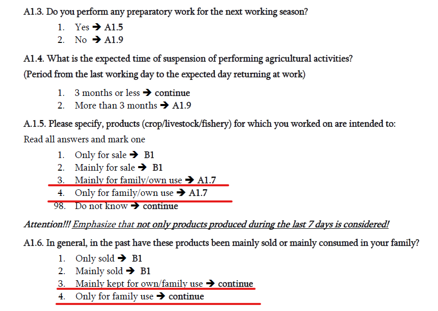

# Introduction
Since the passing of the [resolution concerning statistics of work, employment and labour underutilization](https://www.ilo.org/global/statistics-and-databases/standards-and-guidelines/resolutions-adopted-by-international-conferences-of-labour-statisticians/WCMS_230304/lang--en/index.htm) in 2013 at the 19th International Conference of Labour Statisticians (ICLS) surveys are at risk of a series break due to the change in the concept of employment.

In short, the ICLS 19 resolution restricts employment to *work performed for others in exchange for pay or profit*, meaning that own consumption work (e.g., subsistence agriculture or building housing for oneself) are not counted as employment.

The GLD codes the harmonization’s `lstatus` variable based on the concept used in the survey. In the case of the Georgian LFS this change occurs after 2019, when the survey switches to new definition. As a result, [time series data](utilities/GEO_lstatus.png) show a decrease in the size of employed and labor force participants for the 2020-2022 round. However, the code can be altered to try to match the previous definition. And this operation can be done conveniently taking advantage of the questionnaire's structure. 

# Framework for identifying the employed in the 2020-2022 GEO LFS

The information on current activity were used to define the employed using Questions A1-A9 in the questionnaire. The general flow of section A involves first asking the individual if he/she engaged in any activity to produce agricultural or fishery products in the past 7 days, for pay or for own use/consumption, if no agricultural activities then any non-agricultural activities, and lastly if no activities engaged what was the reason; if the individual reports otherwise, he/she would be asked about information regarding temporary absence from employment. 

# Current coding for the GEO LFS

In 2017-2019, the respondents who indicate that they either worked for salary (A1 is Yes) or engaged in activities for own consumption (A2 is Yes) are employed (B1 is only for employed respondents).

In 2020-2022, two separate questions (A1.5 and A1.6) were added to confirm whether the production from your main activity (from A1) was for profit or for own use. These two questions allow users to change `lstatus` between the old and the new definitions by adding observations who chose category 3 or category 4 in question A1.5 and A1.6.

The current coding for 2020-2022 is fairly straightforward:
 
<ins>replace lstatus=1 if inlist(A1_5,1,2)| inlist(A1_6,1,2)|A2==1|A3==1|A4==1|inrange(A6,6,9)|A7==1|A8==1|A9==1</ins>
 

# Coding to convert the 2020 ILFS to the old definition

In converting back to the old definition, the approach adopted here is to create a variable that identifies those that are engaged in non-market farming, and those who were absent for less than a month from non-market farming. The code below should be pasted after the code creating the `lstatus` variable based on the 2020 definition. 

