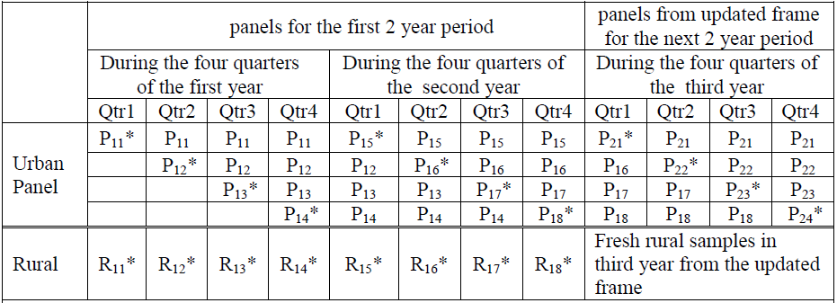
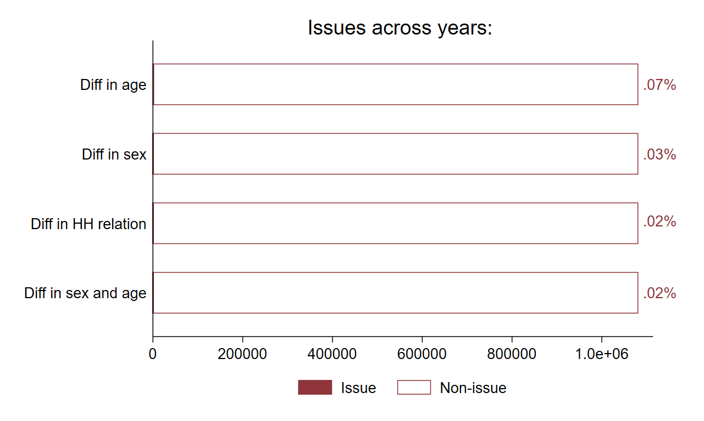
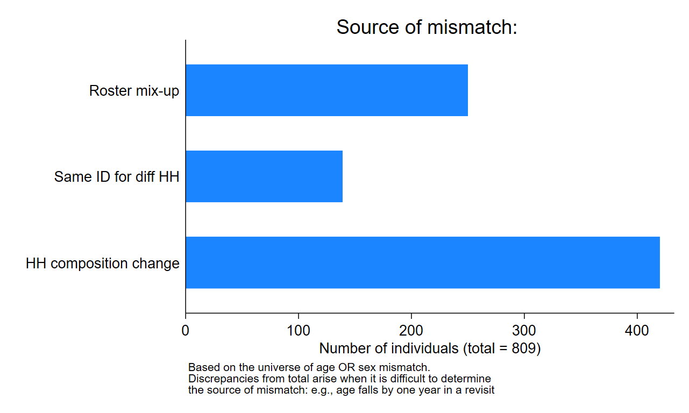
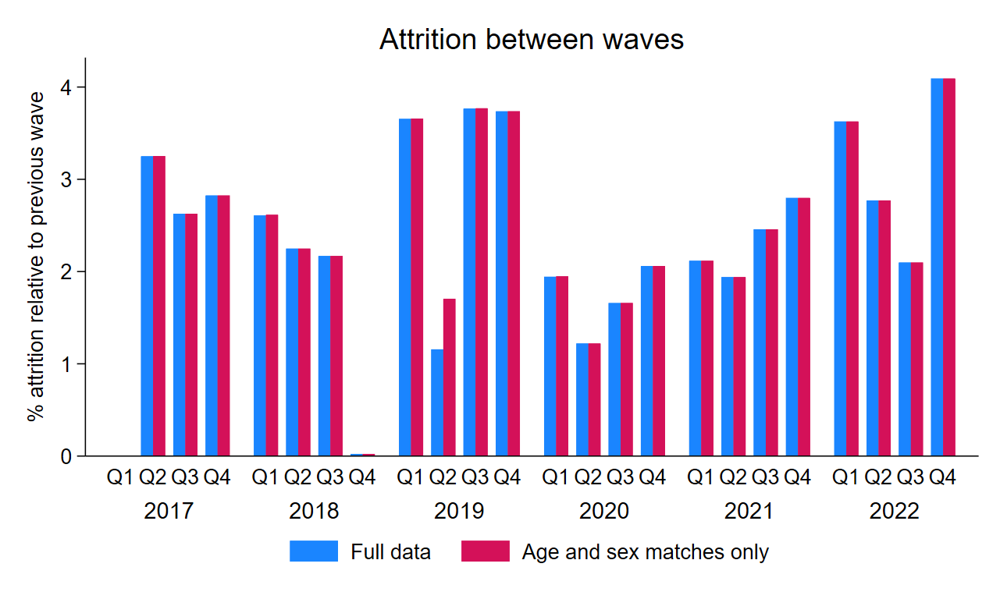
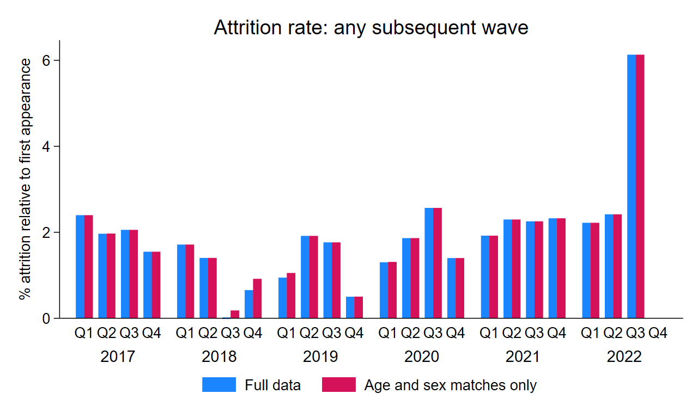
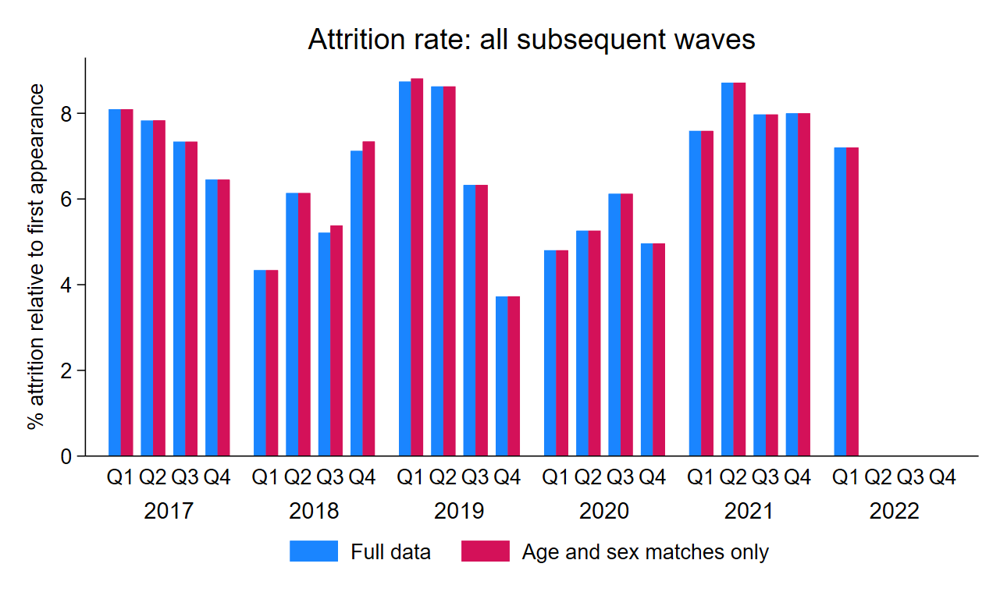

# Urban panel data from the PLFS

## Overview
The Periodic Labour Force Survey (PLFS) employs a two-stage sampling design to gather employment data across India. For urban areas, respondents were visited for four consecutive waves prior to replacement to form a so-called "in-for-4" rotation panel scheme, while for rural regions were only visited once; thus, the rural data is cross-sectional. When the urban rotation panel data is combined with the single-visit cross-sectional data from rural areas, it facilitates users to generate nuanced labor estimates on a quarterly basis for each state, segmented by urban and rural demographics.

The PLFS adopts a strategic rotational design for its urban samples, ensuring consistent data capture throughout the year. The starting point in this rotational system is the P11 panel, designated as the "first" panel in the survey cycle. Representing 25% of the annual urban allocation, this panel sets the pace for the year-long survey, which spans four quarters. As each quarter unfolds, new panels are successively introduced, while the earlier ones, like the P11, are revisited. It's essential to highlight that the initial household listings remain unchanged during revisits, even if there are declinations in participation or a change in dwelling occupants.

The PLFS rotational scheme is designed with a two-year duration. This means that the sampling frames for both rural and urban areas remain consistent for this two-year stretch. Within this context, the dwelling serves as the primary unit of analysis, not its changing inhabitants. Original household IDs are  retained, even if there's a shift in the residents of a dwelling. This consistent identification is maintained across all panels, including the foundational P11. Once a panel completes its four-quarter survey cycle, it's succeeded by a new one in the subsequent survey year. By year's end, a 75% overlap exists between samples from two adjacent quarters, ensuring a harmonized surveying environment with panels coexisting at various quarters. 

## Issues with FSU codes between 2017-2018

A challenge with the PLFS data is the lack of household identifiers. However, it's feasible to create IDs based on the First Sampling Unit (FSU) codes and household numbers. Between 2017 and 2018, the FSU codes underwent changes, complicating household identification using the standard ID assignment method. Thankfully, Mr. Enevoldsen of the Yale Economic Growth Center and Mr. Bhattacharya provided an invaluable solution by reconstructing the FSU codes, allowing households from these two years to be matched. As Mr. Enevoldsen elaborates in his [blog post](https://egc.yale.edu/about/perspectives/filling-gaps-indias-official-labor-force-survey-constructing-urban-panel), an unconstrained optimization model was initially considered for one-to-one renumbering. However, Mr. Bhattacharya identified a simpler substitution cipher for FSU digits. For instance, a "0" digit in PLFS 2017-18 was replaced by a "6" in PLFS 2018-19. By adjusting each FSU digit, households from PLFS 2017-18 re-interviewed in 2018-19 were matched entirely.

## Strategy for creating panel variable

A common strategy to identify the panel group to which a household belongs is by identifying the year and quarter that the household was first visited. In the case of India, a household interviewed in the first quarter of 2017-18 is P11. But there were a couple of instances were the household ID was re-used across non-consecutive survey years, and even within the same survey year as in the case of the PLFS 2021-22. With visit number independently constructed from the `hhid`, it becomes possible to identify the panel groups, as indicated by the variable `panel`, by utilizing information based on the wave of first visit. We adopt Mr. Enevoldsen's strategy, which uses visit number and a monotonic transformation of wave to identify the panel groups. After concatenating the `panel` in the `hhid` and `pid` variables, the appended dataset has unique `pid` data for each survey wave.

## Quality checks

### Age and sex mismatches

It is common practice for research works that use panel surveys to identify extent to which the age and sex mismatches occur for the same person ID. These cases are typically dropped from the analyses, and reweighting is performed on the trimmed data, as done for instance by [Donovan, et al (2023)](https://academic.oup.com/qje/article-abstract/138/4/2287/7181328). Fortunately, the India urban panel data has negligible cases of age and/or sex mismatches: there are less than 1000 individuals (out of 900,000+ unique individuals) where such mismatches were observed, and among these cases, we extrapolated that these cases arise due to members' entry into and exit from the household. 

### Attrition

We also examine three measures of attrition: between waves, between the first visit and any subsequent wave, and between the first visit and all subsequent waves. The attrition rates for each measure are shown below, separating calculations for attrition in terms of ID only, and both ID and age-sex matches. 

#### Attrition between two consecutive waves

#### Attrition between the first visit and any subsquent wave

#### Attrition between the first visit and all subsequent waves

