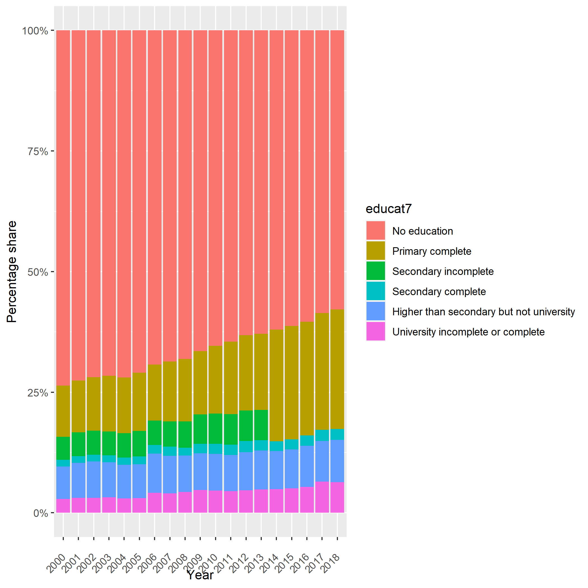

# Morocco's education system

Morocco's education system is structured into several distinct levels, each with its own set of requirements and duration. The system begins with the optional pre-primary education followed by nine years of compulsory basic education, starting from age 6. This basic education is divided into two cycles: six years of primary education and three years of lower secondary education. After completing lower secondary education, students have the option to pursue either general/technical secondary education or vocational training. The general/technical secondary education lasts for three years and culminates in the baccalauréat exam, which is crucial for entry into higher education. For vocational training, students can enter a variety of programs post-lower secondary education, depending on their qualifications and the entrance examinations they pass.

The Morocco ENE uses a 4-digit classification system to identify respondents' educational attainment called the *Nomenclature nationale des diplômes* (NND). In the raw datasets, the detailed education codes used the NND 2000, but were available only between the 2000 and 2013 rounds. In the succeeding years, the datasets we received did not include the 4-digit education codes, and only aggregated education categories were available.

The mapping between the GLD `educat7` categories and the broad education categories used in the 2014-2018 rounds are shown in the table below:

| N | Broad categories used in ENE 2014-2018 | English Translation | `educat7` mapping |
|---|----------------------------|---------------------|--------------------------|
| 1 | Diplômes et certificats de l'enseignement primaire | Diplomas and certificates of primary education | 3 "Primary complete" ok |
| 2 | Diplômes de l'enseignement secondaire | Secondary education diplomas | 5 "Secondary complete" ok |
| 3 | Diplômes supérieurs délivrés par les facultés | Higher diplomas awarded by faculties | 7 "University incomplete or complete" complete |
| 4 | Diplômes supérieurs délivrés par les écoles et universités | Higher diplomas awarded by schools and universities | 7 "University incomplete or complete" complete |
| 5 | Diplôme de techniciens et de cadres moyens | Diploma for technicians and mid-level executives | 6 "Higher than secondary but not university" higher secondary/ TVET |
| 6 | Diplôme de techniciens supérieurs | Advanced Technician Diploma | 6 "Higher than secondary but not university" higher secondary/ TVET |
| 7 | Diplôme en qualification professionnelle | Diploma in professional qualification | 6 "Higher than secondary but not university" higher secondary/ TVET |
| 8 | Certificats en spécialisation professionnelle | Certificates in professional specialization | 6 "Higher than secondary but not university" higher secondary/ TVET |
| 9 | Sans diplôme | Without diploma | 1 "No education" |
| 99 | Non déclarés | Not declared | Missing |

For all the rounds, people without diploma (*sans diplôme*) are mapped to "no education", but it is also possible that some of these respondents fall under "primary incomplete". Because there is insufficient information to make the distinction, we simply assigned these responses to "no education", and users are free to recode this to "primary incomplete" should they prefer that classification. 

The implication of this switch from a detailed to a broad classification system is the inability to determine "secondary incomplete". As shown in the chart below, "secondary incomplete" is absorbed by the category "primary complete" in the rounds 2014 onwards. For consistency in the breakdown, users are advised to use `educat5` or `educat4`.

