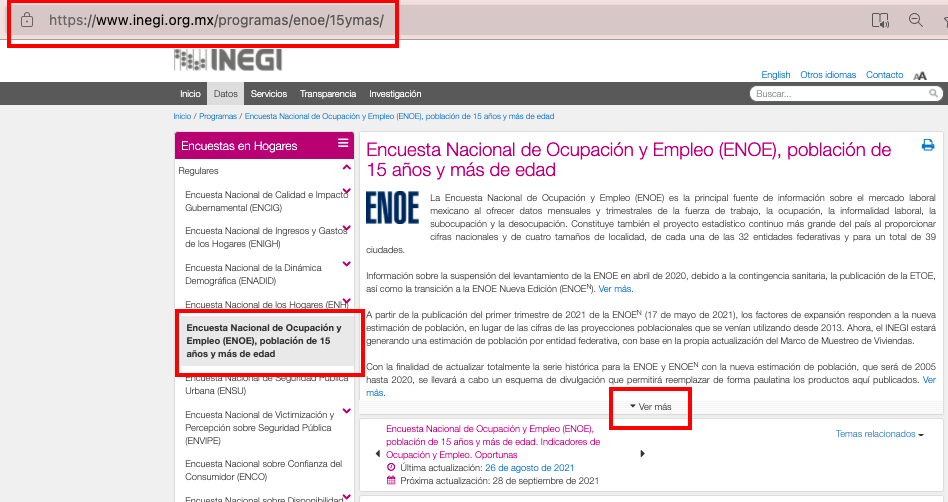
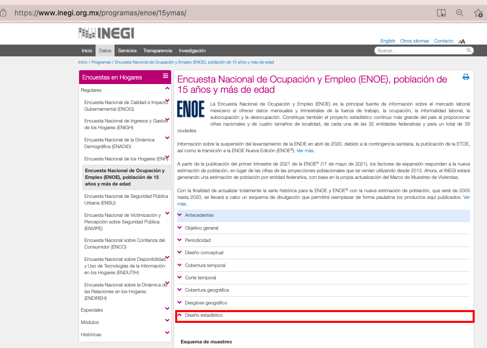
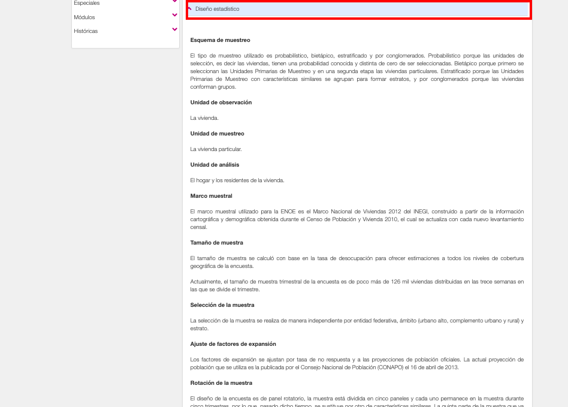

Introduction to the Mexican Periodic Labour Force Survey (PENOE)
================

- [What is the MEX PENOE?](#what-is-the-mex-penoe)
- [What does the MEX PENOE cover?](#what-does-the-mex-penoe-cover)
- [Where can the data be found?](#where-can-the-data-be-found)
- [What is the sampling procedure?](#what-is-the-sampling-procedure)
- [What is the geographic significance level?](#what-is-the-geographic-significance-level)
- [Other noteworthy aspects](#other-noteworthy-aspects)

## What is the MEX PLFS?

The Mexican Labour Force and Unemployment Survey (ENOE) is the Mexican Labour Force Survey run as part of Mexico’s National Surveys series from 2005 to 2020. 

## What does the MEX ENOE cover?

The Mexican ENOE is a labour force survey collecting information on demographic details (age, sex, location), education (academic), social security, labour market activities over the past quarter, as well as time use and activities over the previous 7 days. The years and sample size of PENOE harmonized for GLD are:

| Year | # of Households (HHID)  | # of Individuals (PID) |
|------|-------------------------|------------------------|
| 2005 | 180,392                 | 724,388                |
| 2006 | 183,611                 | 726,237                |
| 2007 | 182,904                 | 717,245                |
| 2008 | 181,185                 | 707,089                |
| 2009 | 179,505                 | 695,809                |
| 2010 | 179,389                 | 691,961                |
| 2011 | 179,492                 | 687,171                |
| 2012 | 179,091                 | 680,036                |
| 2013 | 179,943                 | 682,101                |
| 2014 | 182,537                 | 689,902                |
| 2015 | 183,919                 | 687,891                |
| 2016 | 183,727                 | 678,315                |
| 2017 | 186,075                 | 679,744                |
| 2018 | 185,209                 | 672,964                |
| 2019 | 192,462                 | 693,671                |
| 2020 | 116,309                 | 409,071                |

## Where can the data be found?

The microdata is free and publicly available on the National Institute of Statistics and Geography (INEGI). INEGI created a [dedicated website](https://www.inegi.org.mx/programas/enoe/15ymas/#Microdatos) that records ENOE and all previous versions, besides it contains complete information to understand the framework of the ENOE. Data from 2019 onwards can only be circulated within the World Bank. For further information kindly get in touch with the World Bank Jobs Group.

## What is the sampling procedure?

The ENOE uses a stratified two-stage design. The introductory section of ENOE provides ample detail on the breakdown and goals of the process. Below we share a sequence of images that will allow the user to access the information in the ENOE webpage. The text is in Spanish. Yet, we did a short summary in English at the bottom of this section to give the user a general idea of the information.  

Image 1. Steps to find the information in the webpage
  

  

  
  

  
Reference: Screenshots from ENOE- INEGI webapage. Further details in *Encuesta Nacional de Ocupación y Empleo* under the ["recent version"](https://www.inegi.org.mx/programas/enoe/15ymas/)

[Summarized Translation from the original version]

    The sampling is probabilistic, two-stage, stratified by conglomerates.

    Observation unit: The House.
    Sampling unit: The private home.
    Analysis unit: The home and the residents of the dwelling. [...]

    Sampling frame : The sampling frame used for the ENOE is INEGI's 2012 National Housing Framework, built from the cartographic and demographic information obtained during the 2010 Population and Housing Census, which is updated with each new census survey. [...]

## What is the geographic significance level?

The results are at national, state, and *cities of interest* levels as well as for certain size categories of localities. The cities of interest and sizes of cities, however, may vary over time. It is thus important to check the individual methodology reports. The information on the 2019 ENOE can be found under section 3.3 (page 39/40) of [that year's report](https://www.inegi.org.mx/app/biblioteca/ficha.html?upc=702825190613).

## Other Noteworthy Aspects

### Panel construction

One of the key features of ENOE is its panel survey design, which enables tracking individuals over 5 consecutive quarters. Therefore, we appended harmonized data from 2005 to 2020-Q1.

We did not include the other 2020 quarters due to the adjustments made during the COVID-19 pandemic by INEGI.

For more information about the ENOE survey and decisions related to COVID-19, please visit [Introduction to ENOE.](Support/B%20-%20Country%20Survey%20Details/MEX/ENOE/1.%20Introduction%20to%20ENOE.md)

### Panel features

We are going to present the structure of the constructed panel, with the aim of identifying certain flags in the data.

The Image bellow shows a 15% discrepancy in individual age. This aligns with our expectations regarding age changes among panel individuals. As they are tracked over a year and three months, some individuals may have birthdays during this interval.
<figure>
  
</figure>

We observe that approximately 280,000 individuals (14% of the total) present a "Roster mix-up" within the data. They have the same age and gender but are identified with different personal identifiers.
<figure>
  
</figure>

The last Figure illustrates panel attrition between consecutive waves. On average, 7% of the interviewed individuals do not participate in the subsequent wave. This is an expected attrition rate for the panel.

<figure>
  
</figure>

