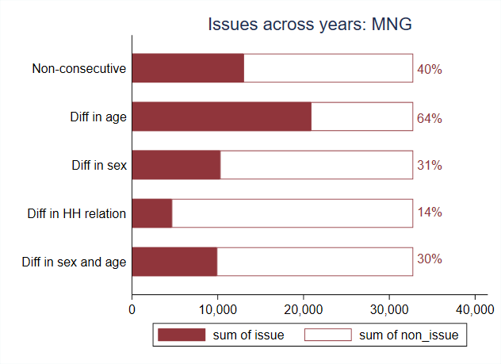
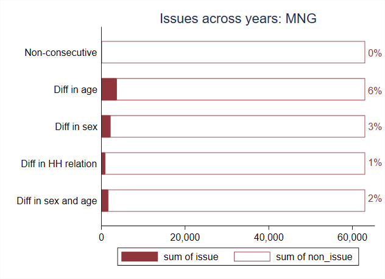

# Constructing panels in the MNG LFS

Rotation panels are a valuable resource for researchers, enabling them to study labor transitions by examining information about the same individual over multiple periods. Starting in 2019, the survey implemented a rotation sampling design where each round re-interviews 75% of the previous round's sample, while 25% exit. This is a common approach among National Statistical Offices (NSOs) that utilize rotation sampling.

However, Mongolia's design diverges from the standard practice. Instead of extending the rotation across multiple years, it resets annually. This means that the survey doesn't re-interview 75% of the sample from the last quarter of the previous year, instead initiating with a fresh panel each year.

We have validated this approach through our panel analysis, in which we observed that a significant number of individual IDs are reused in non-consecutive rounds. For instance, IDs from 2019 reappear in the 2021 round, resulting in multiple cases of erroneous matches in age and sex for a given person ID.

It's crucial to incorporate the year as part of the household identifier to distinguish the unique household IDs each year. This addition proves particularly beneficial when forming a  panel, effectively resolving issues with non-consecutive person IDs and significantly decreasing inconsistencies in individual age and sex data.

Despite these improvements, minor inconsistencies persist. Most of these are attributable to ID mix-ups within households, meaning the same household members receive different roster IDs across periods. Occasionally, a new member joins a household and is assigned an ID previously associated with a different person. In rare instances, there are complete changes in households within the same dwelling, which results from the survey's focus on tracking the dwelling to form the panel rather than the household itself. Lastly, minor issues with age data appear, such as an ID associated with more than one year's increase in age within the survey year. Estimates of these issues can be seen below:

