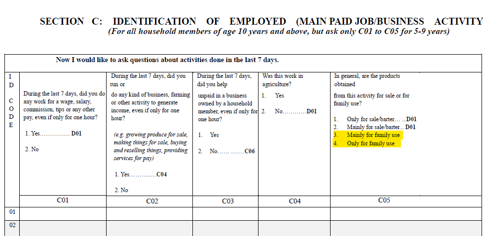
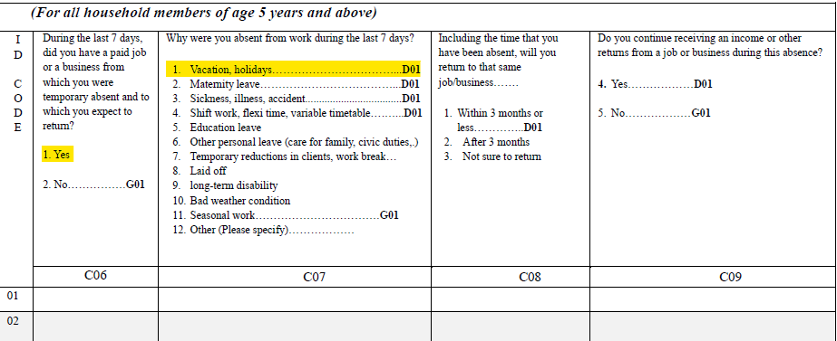

# Introduction
Since the passing of the [resolution concerning statistics of work, employment and labour underutilization](https://www.ilo.org/global/statistics-and-databases/standards-and-guidelines/resolutions-adopted-by-international-conferences-of-labour-statisticians/WCMS_230304/lang--en/index.htm) in 2013 at the 19th International Conference of Labour Statisticians (ICLS) surveys are at risk of a series break due to the change in the concept of employment.

In short, the ICLS 19 resolution restricts employment to *work performed for others in exchange for pay or profit*, meaning that own consumption work (e.g., subsistence agriculture or building housing for oneself) are not counted as employment.

The GLD codes the harmonization’s `lstatus` variable based on the concept used in the survey. In the case of the NPL LFS this change occurs between 2008 and 2017, when the survey switches to new definition. As a result, [time series data](utilities/NPL_lstatus.png) show a decrease in the size of employed and labor force participants between 2008 and 2017. However, the code can be altered to try to match the previous definition. And this operation can be done conveniently by taking advantage of the questionnaire's structure. 


# Framework for identifying the employed in the 2017 NPL LFS

The information on current activity was used to define the employed using Questions C01-C09 in the questionnaire. The general flow of section C, "Definition of Employment", involves first asking the individual if he/she engaged in any paid or unpaid activities in the past 7 days, the purpose of the activity (i.e., for sale or for family use), if no agricultural activities then any non-agricultural activities, and lastly if no activities engaged what was the reason; if the individual reports otherwise, he/she would be asked about information regarding temporary absence from employment (i.e. whether it is a paid leave or not). 


# Current coding for the 2017 NPL LFS

In 2017, the respondents who indicate that they either:

<br>
1) worked for salary (C01 is Yes) or
<br>
2) engaged in paid non-agricultural activities (C04 is No) or
<br>
3) agricultural activities (mainly) for sale/barter (C05 is either 1 or 2) or
<br>
4) were temporarily absent from work with wage/specific reasons (i.e., vacation, maternity leave, sickness/illness/accident, or shift work/variable timetable)
<br>
are employed. All these answers will lead respondents to question D01 which is only for employed respondents.

The current coding for 2017 is straightforward:
```
replace lstatus=1 if wrk_paid==1|wrk_agri_sect==2|inlist(purp_agripdct,1,2)|inrange(rsn_absent,1,4)|return_prd==1|paidleave==1

``` 
in which the variables correspond to all four conditions previously mentioned for a given respondent to be defined employed. 

# Dual Employment Workers

Dual employment here refers to observations who not only have an unpaid job, working only or mainly for family consumption, but also have a paid job. Following the questions in Section C, "Identification of Employment", dual employment workers will also be directed to Section D, meaning that they are treated as employed.





For instance, following the highlighted choices in the questionnaire screenshots shown above, a dual employment worker will go to Question D01 which is about occupation title. In the case of NPL 2017, only two observations followed this "route". And since we did not further differentiate dual employment workers based on which job is the main job, we coded such dual employment workers **employed**.   


# Coding to convert the 2017 NPL LFS to the old definition


In converting back to the old definition, the approach adopted here is simply to remove all the restrictions on `A1_5` and `A1_6`, and instead, to code respondents who have answered question A1.5 to A1.9 as employed regardless of their answers to question A2 and questions forward. The revised codes would be:
<br>
<ins>`replace lstatus=1 if inlist A2==1|A3==1|A4==1|inrange(A6,6,9)|A7==1|A8==1|A9==1`</ins>
<br>
<ins>`replace lstatus=1 if [inrange(A1_5,3,4)|inrange(A1_6,3,4)]&!mi(A1_9)`</ins>
<br>

Own consumption workers are by definition self-employed and in the private sector. Regarding their industry and occupation, question A1.9 directly provides their industrial classification codes in NACE rev.2. And in 2020-2022, own-consumption workers' industry ranges from NACE rev.2 111 to 322, which are all in "Agriculture". As for occupation, users could refer to for-salary workers' occupations with the same industry codes. The data shows that own-consumption workers' industrial codes are mostly in "Elementary Occupations".  
