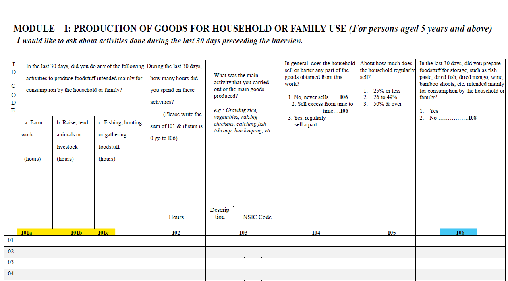
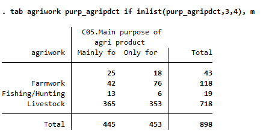
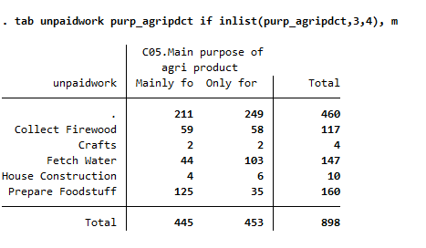

# Introduction
Since the passing of the [resolution concerning statistics of work, employment and labour underutilization](https://www.ilo.org/global/statistics-and-databases/standards-and-guidelines/resolutions-adopted-by-international-conferences-of-labour-statisticians/WCMS_230304/lang--en/index.htm) in 2013 at the 19th International Conference of Labour Statisticians (ICLS) surveys are at risk of a series break due to the change in the concept of employment.

In short, the ICLS 19 resolution restricts employment to *work performed for others in exchange for pay or profit*, meaning that own consumption work (e.g., subsistence agriculture or building housing for oneself) are not counted as employment.

The GLD codes the harmonization’s `lstatus` variable based on the concept used in the survey. In the case of the NPL LFS this change occurs between 2008 and 2017, when the survey switches to new definition. As a result, [time series data](utilities/NPL_lstatus.png) show a decrease in the size of employed and labor force participants between 2008 and 2017. However, the code can be altered to try to match the previous definition. And this operation can be done conveniently by taking advantage of the questionnaire's structure. 


# Framework for identifying the employed in the 2017 NPL LFS

The information on current activity was used to define the employed using Questions C01-C09 in the questionnaire. The general flow of section C, "Definition of Employment", involves first asking the individual if he/she engaged in any paid or unpaid activities in the past 7 days, the purpose of the activity (i.e., for sale or for family use), if no agricultural activities then any non-agricultural activities, and lastly if no activities engaged what was the reason; if the individual reports otherwise, he/she would be asked about information regarding temporary absence from employment (i.e. whether it is a paid leave or not). 


# Current coding for the 2017 NPL LFS

In 2017, the respondents who indicate that they either:

<br>
1) worked for salary (C01 is Yes) or
<br>
2) engaged in paid non-agricultural activities (C04 is No) or
<br>
3) agricultural activities (mainly) for sale/barter (C05 is either 1 or 2) or
<br>
4) were temporarily absent from work with wage/specific reasons (i.e., vacation, maternity leave, sickness/illness/accident, or shift work/variable timetable)
<br>
are employed. All these answers will lead respondents to question D01 which is only for employed respondents.

The current coding for 2017 is straightforward:
```
replace lstatus=1 if wrk_paid==1|wrk_agri_sect==2|inlist(purp_agripdct,1,2)|inrange(rsn_absent,1,4)|return_prd==1|paidleave==1

``` 
in which the variables correspond to all four conditions previously mentioned for a given respondent to be defined employed. 

# Dual Employment Workers

Dual employment here refers to observations who not only have an unpaid job, working only or mainly for family consumption, but also have a paid job. Following the questions in Section C, "Identification of Employment", dual employment workers will also be directed to Section D, meaning that they are treated as employed.


For instance, following the highlighted choices in the questionnaire screenshots shown above, a dual employment worker will go to Question D01 which is about occupation title. In the case of NPL 2017, only two observations followed this "route". And since we did not further differentiate dual employment workers based on which job is the main job, we coded such dual employment workers **employed**.   


# Coding to convert the 2017 NPL LFS to the old definition

## Identifying own-consumption workers 
In converting back to the old definition, the approach adopted here is adding people who chose category 3 and 4 for Question C05 to the employed population, and assigning industries and occupations for them based on early years' records. Based on the current code we used to identify paid employees or workers who produce for sale/barter, we will use Section C and Section I, "Production of Goods for Household or Family Use", to identify people who were only working unpaid for own consumption and thus were excluded in the new definition.

The revised codes would be:
```
**Current Code**
replace lstatus=1 if wrk_paid==1|wrk_agri_sect==2|inlist(purp_agripdct,1,2)|inrange(rsn_absent,1,4)|return_prd==1|paidleave==1

**New code using purp_agripdct and Section I to identify people working for own consumption only**
replace lstatus=1 if inlist(purp_agripdct,3,4)& temp_absent==2

NOTE: the new code should yield 888 observations in 2017, meaning that 888 individuals only worked unpaid for family consumption. And following the questions in Section C, they were directed to Section G, "Job Search and Availability" first, and then were directed to Section I to describe the type of work they engaged in and the time they spent accordingly. For reference, 898 observations answered either category 3 or 4 to Question C05. The gap, 10 observations, includes 2 dual employment workers and 8 missing values for Question C06 (variable "temp_absent").

``` 

## Assigning industries and occupations

Own-consumption workers are by definition self-employed and in the private sector. In Section I, the questions are generally categorized into agricultural work and non-agricultural work. The questions are shown below:




The yellow highlights are agricultural work whereas the blue ones are non-agricultural. Kindly note that Section J, "Own-use Production of Services", also includes work for family consumption, such as unpaid care/help/assistance to family members. But we did not consider Section J because firstly, these unpaid services were not treated as types of "work" for own-consumption; and secondly, Section I and Section J are not mutually exclusive. Observations who were engaging in farm work for family consumption, for example, might also provide unpaid care to family members, causing a problem to industry and occupation assignments. 

Below are the distributions of own-consumption workers' activities in 2017. Agricultural work includes: farm work, fishing/hunting, and livestock tending. Non-agricultural work includes: collecting firewood, crafting, fetching water, house construction, and foodstuff preparation. 

|||
|:-----------------------------------------------:|:---------------------------------------------------:|

According to the distribution of own-consumption workers' major industries and occupations in 1998 and 2008, the table below provides the options of industries and occupations for each type of work.  

|**CATEGORY**|**Agricultural Work**|**Non-Agricultural Work**|
|:----------:|:-------------------:|:-----------------------:|
|**Industry**|     Agriculture     | 1) Collecting Firewood/Fetching Water/Foodstuff Preparation - Agriculture; 2) Crafting - Manufacture; 3) House Construction - Construction|
|**Occupation**| Elementry Occupation/Skilled Agricultural Worker| 1) Collecting Firewood/Fetching Water - Skilled Agricultural Worker; 2) Crafting/House Construction - Craft Workers; 3) Foodstuff Preparation -  Service and Market Sales Worker|

