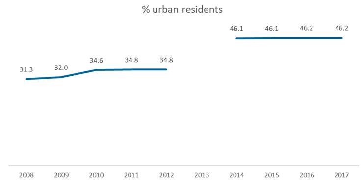

# Caveats in the urban variable

The LFS can be used to generate estimates of urban population in Thailand. However, there are a few caveats to note.

First, it is essential to note that the urban variable in the GLD considers sanitary districts, which is an area classification in THA LFS between 1985-2000, as urban areas. 
This decision considers the reclassification that occurred in May 1999, when sanitary districts were reclassified as sub-district municipalities (see this [report](utilities/Central-Local-Rel-THA.pdf)).
Also, this approach allows us to generate estimates that align with the World Development Indicators (WDI) and provide a smoother year-to-year change in the urban population when the National Statistical Office (NSO) started using the urban-rural classification in 2001. If, alternatively, sanitary districts were classified as rural areas, there would be a sharp increase in the urban population rate from 23% to 34% between 2000 and 2001. However, to our knowledge, there were no significant indications of rural-urban migration or other exogenous factors that makes a strong case for the significant change during this period.  

Secondly, there is a sharp increase in the urban population between 2012 and 2014, which is likely driven by a rebasing of weights to align with the 2010 Census. This interpretation is supported by the fact that the unweighted share of respondents by urban-rural did not change between this period, and the sharp changes can only be observed for weighted estimates. 

| Survey | **Urban % weighted** | **Urban % unweighted** |
|---|---|---|
| LFS - 2012 | 35% | 56% |
| LFS - 2014 | 46% | 55% |

Additionally, the average sampling weights between 2012 and 2014 increased substantially for urban residents and decreased for rural residents. 

The weighted estimates in 2014 are also close to the estimated numbers in the 2010 Census, including for regional estimates such as the Central Region (see below) where there is a 43% increase in urban population between 2012 and 2014.

| **Survey** | **Urban** | **Rural** |
|---|---|---|
| LFS - 2012 | 6,003,375 | 10,140,894 |
| LFS - 2014 | 8,658,506 | 10,286,770 |
| Census 2010 | 8,280,992 | 9,902,316 |

