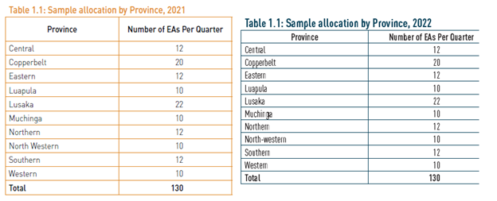

# Introduction to the ZMB Labour Force Survey (ZMB LFS)

- [What is the CCC survey?](#what-is-the-ccc-survey-acronym)
- [What does the CCC survey cover?](#what-does-the-ccc-survey-acronym-cover)
- [Where can the data be found?](#where-can-the-data-be-found)
- [What is the sampling procedure?](#what-is-the-sampling-procedure)
- [What is the significance level?](#what-is-the-geographic-significance-level)
- [Other noteworthy aspects](#other-noteworthy-aspects)

## What is the ZMB LFS?

The Labour Force Survey is a household-based sample survey conducted by the Zambia Statistics Agency in collaboration with the Ministry of Labour and Social Security. The LFS collects data on the labour market activities from eligible individuals in selected households.

The major objective of the LFS is to measure the size of the labour force by its characteristics such as age, sex, industry, sector of employment and education.

## What does the ZMB LFS cover?

The Zambian LFS is a labour force survey collecting information on demographic details (age, sex, location), education (both academic and vocational), labour market activities over the 7 day recall period as well as migration. The years and sample size of EUS harmonized for GLD are:

| Year	| # of Households	| # of Individuals	|
| :-------	| :--------		| :--------	 	|
| 2008	| 29,913		| 156,354		|
| 2012	| 11,480		| 59,274		|
| 2014	| 11,476		| 58,985		|
| 2017	|  9,241		| 45,453		|
| 2018	| 10,289		| 49,551		|
| 2019	|  6,862		| 34,010		|
| 2020	|  9,184		| 45,354		|
| 2021	|  9,774		| 44,115		|
| 2022	| 10,251		| 47,060		|

## Where can the data be found?

The data was shared directly with the World Bank by the Zambia Statistics Agency. It may be shared with World Bank staff but not outside the organization.

## What is the sampling procedure?

The ZMB LFS follows a two-stage stratified sampling strategy, aiming to provide an accurate picture of labor market outcomes of the non-institutionalized population (that is, all but people living in hospitals, army barracks, and other institutional housing arrangements). In the first stage a selection of Enumeration Areas (EA) for the census was drawn with probability proportional to size, in the second stage, households in the EAs were selected at random.

For further details on the sampling and the particulars of the stratification across the years, please see the annual survey reports.

## What is the geographic significance level?

The surveys are representative at the national, urban-rural, and province level of Zambia, where the province is the first (largest) subnational administrative area in the country.

The above is not true for 2019 where the survey was cut short due to the CoVid-19 pandemic. The 2019 data are only representative at national and urban-rural level.

## Other noteworthy aspects

### Changes in the labor force concepts in the questionnaire

There are two relevant kinds of changes to note in the questionnaire. The main change is the switch in employment definition in 2017 to the new concept of employment as work for market exchange, as determined during the 19th ICLS ([more details on the ICLS definition here]( https://ilostat.ilo.org/resources/concepts-and-definitions/description-work-statistics-icls19/)). Thus key indicators cannot be compared directly across time. 

The other change concerns the wording and skip patterns at the start of the employment section over years prior to 2014 that may affect the estimates. The detailed history of these changes is [covered here](History%20of%20changes%20to%20employment%20definitions%20in%20the%20ZMB%20LFS.md).

### Duplicate HHID and PID in 2021

The data in 2021 contains 1625 duplicates from 217 households (3.5% and 2.2% percent of the individuals and households in the survey, respectively). The GLD could identify that, likely, these are different households but could not secure additional variables (e.g., enumerator ID or interview timestamps, to differentiate them. Hence, users are kindly requested to take this into account. 

### Changes to the provinces

The province of Muchinaga was created in 2011 and is thus in all surveys in GLD. It was created out of four districts from the Northern Province and the district of Chama from the Eastern province. In 2021 Chama district was re-assigned to the Eastern province. Similarly, the districts of Chirundu and Itezhi were moved from the Lusaka and Central provinces to the Southern Province in 2021 (see [newspaper article here](https://www.lusakatimes.com/2021/11/18/president-hichilema-to-give-back-chirundu-and-itezhi-districts-to-southern-province/)). The GLD team could not establish whether these changes were included in the 2022 data. The number of EAs in the sample allocation seems not to have changed from 2021 to 2022 (see screenshots below).

  
*<small>Comparison of sample sizes (from respective survey reports)</small>*

  

### Lack of `empstat` information in the 2012 LFS

The data received by the GLD team does not contain the questionnaire variable denoting the employment status of workers in 2012. Only paid employees (code `1` of `empstat`) could be classified by identifying respondents who answered a separate section only reserved to paid employees. Thus, the 2012 data `empstat` variable is either `1` for paid employees or missing for all other workers (i.e., all other cases when `lstatus == 1`.

### Re-denomination of the Kwacha

The Zambian Kwacha is the currency of Zambia and the wage information in the GLD harmonization is recorded in Kwacha. The Kwacha was renominated in 2013 [link](https://www.parliament.gov.zm/sites/default/files/documents/acts/Redomination%20of%20Currency.PDF) such that a new kwacha was worth 1000 old kwacha. Thus, if comparing data from 2012 to data from other years, the 2012 data should be divided by 1000.
 

