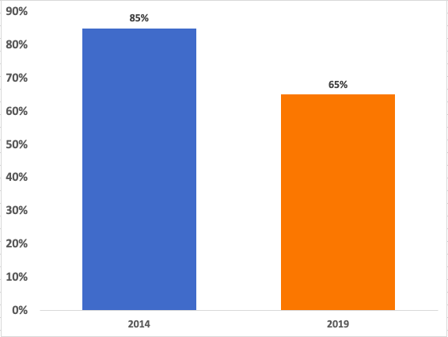

# ICLS Change

The international conference labour statistics classification or ICLS is followed in the ZWE LFS Section AG on “Agricultural Work and Market Orientation”  starting in 2019. The 19th International Conference of Labour Statisticians (ICLS) changed the concept of work to refer only to work for pay or profit. In particular, the change affects individuals that work to produce goods entirely or mostly for their consumption. In the new classification, these individuals are not considered as employed. Below, the figure shows the new AG section in the ZWE questionnaire.

<br></br>

<br></br>

Individuals who work on their own business if it is not in the field of crop farming or animal rearing are understood to be in a business for pay or profit. If they work in agriculture, they are subsequently asked whether their production is mostly for household consumption or mostly for the market (AG3). If produce is for the market, they are asked questions on this employment in the main job section (AG3 leads to MJ1). If produce is mostly for household consumption, they are additionally asked whether this work was done as a worker for hire. In case the work is purely subsistence farming a few more questions are asked, but these individuals would skip the sections on employment completely: the question flow leads to AG7, where the enumerator is instructed to skip to the Job Search (JS) section. This contrasts with previous ICLS definitions and previous surveys (e.g., the LFS from 2014 and before) where any work would have been considered employment. 

## GLD approach 

The GLD team considered the change in definition to the 2019 ICLS definitions to match previous definitions and codify subsistence agriculture workers as employed. The cases where production is for household consumption (AG3 codes 3 and 4) and not for hire (AG4 code 2) are identified whenever they would otherwise be unemployed or out of the labour force by the survey. Individuals who replied as having a main job already and additionally have their consumption production are not recorded as agriculture workers.

To fill in the labour variables, the household consumption agriculture workers are assumed to be self-employed (for variable empstat) and to be working in the private sector (for variable ocusec). Codes from AG5 are used to codify the industry, while for occupation individuals are classified with ICSO-08 sub-major group code 63 ("Subsistence Farmers, Fishers, Hunters and Gatherers") (variable occup_isco). Therefore, they are code 6 (“Skilled agriculture workers”) for variable occup and of medium skill level for variable occup_skill. The information from AG7 is used to code the hours worked.

Below we share a code for the users to see how the GLD team would address the change in definition. However note that the harmonized data for 2019 has not been changed to ressemble other years, this is for the user to decide during their process of analysis. The ICLS-19 is used in all future LFS to date.

```
* This section changes the variables on labour for the main job for those working in agricutlure
* for own production, which is no longer seen as employment according to ICLS 19

* Create a variable to identify the cases that are to be changed
* In the ZWE 2019 case, people who answered that the animals/products they work on 
* are mainly or only for family use (codes 3 and 4 of AG3) and where this work was
* not for hire (AG4 == 2) are assigned as being outside the labour force by ICLS-19.
* These cases, whether they are out of the labour force or otherwise unemployed need 
* to be defined as employed to align with previous definitions.
* lstatus refers to labour status
* empstat refers to employment status
* industrycat refers to industry category
* occup refers to occupation
* whours refers to working hours
* nlfreason is not in the variable that codes information for individuals non in the labour force

gen old_icls = inrange(AG3,3,4) & AG4 == 2 & inrange(lstatus,2,3)

*<_lstatus_>
	replace lstatus = 1 if old_icls == 1
*</_lstatus_>


*<_potential_lf_>
	replace potential_lf = . if old_icls == 1
*</_potential_lf_>


*<_nlfreason_>
	replace nlfreason = . if old_icls == 1
*</_nlfreason_>


* Assume own production workers are self employed
*<_empstat_>
	replace empstat = 4 if old_icls == 1
*</_empstat_>


* Assume own production workers work in the private sector
*<_ocusec_>
	replace ocusec = 2 if old_icls == 1
*</_ocusec_>


* Use AG5 to input industry
*<_industry_orig_>
	replace industry_orig = AG5 if old_icls == 1
*</_industry_orig_>


* Use AG5 to input ISIC industry
*<_industrycat_isic_>
	gen helper = AG5 if old_icls == 1
	replace helper = helper + "00" if !missing(helper)
	replace industrycat_isic = helper if old_icls == 1
	drop helper
*</_industrycat_isic_>


* Input own production workers are in Agriculture
*<_industrycat10_>
	replace industrycat10 = 1 if old_icls == 1
*</_industrycat10_>


*<_industrycat4_>
	replace industrycat4 = 1 if old_icls == 1
*</_industrycat4_>


* Assume own production workers are sub-major group 63 "Subsistence Farmers, Fishers, Hunters and Gatherers"
*<_occup_isco_>
	replace occup_isco = "6300" if old_icls == 1
*</_occup_isco_>


* Assume own production workers are "Skilled agriculture workers"
*<_occup_>
	replace occup = 6 if old_icls == 1
*</_occup_>


* As a consequence of occup, own production workers are medium skill level
*<_occup_skill_>
	replace occup_skill = 2 if old_icls == 1
*</_occup_skill_>


* Use AG7 as hours worked
*<_whours_>
	replace whours = AG7 if old_icls == 1
	replace whours = . if whours == 0
	label var whours "Hours of work in last week primary job 7 day recall"
*</_whours_>


* Unemployment detals to missing if own production worker
*<_unempldur_l_>
	replace unempldur_l = .  if old_icls == 1
*</_unempldur_l_>


*<_unempldur_u_>
	replace unempldur_u = . if old_icls == 1
*</_unempldur_u_>
```

## ILO figures

According to official statistics from ILO for ZWE, the change of definition signifies a significant fall on the Labour Force Participation of around 20%. See the figure below prepared from the [ILO data](https://www.ilo.org/shinyapps/bulkexplorer57/?lang=en&id=POP_XWAP_SEX_AGE_LMS_NB_A) using ZWE data. 


<br></br>

<br></br>


