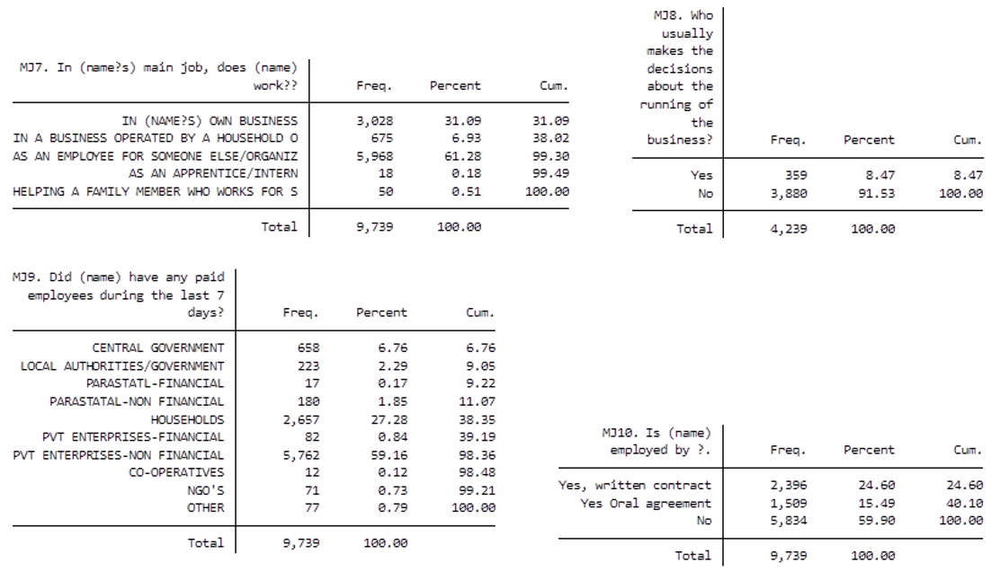

# Introduction to Zimbabwe (ZWE) Quarterly Labour Force and Child Labour Survey

- [What is the ZWE QLFS survey?](#what-is-the-zwe-qlfs-survey)
- [What does the ZWE QLFS survey cover?](#what-does-the-zwe-qlfs-survey-cover)
- [Where can the data be found?](#where-can-the-data-be-found)
- [What is the sampling procedure?](#what-is-the-sampling-procedure)
- [What is the significance level?](#what-is-the-geographic-significance-level)

## What is the ZWE QLFS survey?

The Zimbabwe National Statistics Agency (ZIMSTAT) started conducting Quarterly Labour Force Surveys (QLFS) in the 3rd quarter of 2021 to ensure timely reporting of labour statistics.

## What does the ZWE QLFS survey cover?

The Q3 2021 QLFS is the first of its kind. It follows the 2013 labour force framework adopted at the 19th International Conference of Labour Statisticians (ICLS) that provided new guidelines for measuring and compiling statistics on work, employment, and labour underutilization.

The ZWE LFS is nationally representative. The sampling frame used for the LFCLS was the Zimbabwe Master Sample developed by the then Central Statistical Office after the 2002 Population Census. Except for Harare and Bulawayo, each of the other eight provinces was stratified into four strata according to land use: Communal Lands, Large Scale Commercial Farming Areas (LSCFA), Urban and Semi-Urban Areas, and Small-Scale Commercial Farming Areas (SSCFA) and Resettlement Areas. Only one urban stratum was formed each in Harare and Bulawayo, giving 34 strata in total.

| Year   | # of Households        | # of Individuals|
| :------- | :--------                             | :--------             |
| 2021 (Q3)       | N/A    | 46,085 |
| 2021 (Q4)       | N/A    | 44,163 |
| 2022 (Q1)       | N/A    | 44,442 |
| 2022 (Q2)       | N/A    | 43,362|
| 2022 (Q3)       | N/A    | 42,074 |

## Where can the data be found?
The microdata from the Quarterly LFS is available through the Zimbabwe Statistics [Website](https://www.zimstat.co.zw/labour-force-publications/). A quarterly report is available.

## What is the sampling procedure?
The sampling procedure is a two-stage sample design. The 1st stage was the selection of enumeration areas using the probability proportional to size criteria. The 2nd stage was the selection of households in the selected enumeration areas using a random systematic sampling technique. 500 enumeration areas in total and 12,500 households were selected for the survey. 

## What is the geographic significance level?
The survey is significant at the province level for each quarter. At times it is disaggregated by gender but there is no information at the urban/rural level by province. A word of caution for the user of the final harmonized datasets is that the datasets are aggregated by year to keep consistency; however, since the NSO is yet to release the year datasets, it is not possible to confidently confirm that the yearly significance level is significant beyond the province level. 

## Other Noteworthy Aspects

### Misalignment of the questionnaire and raw data responses
- In 2021 Q3 and Q4, response labels for questions 7, 8, 9 and 10 in the main job section differ from questionnaire labels. The images below show the differences between the questionnaire and the raw data labels.
  

  

  

  

### Employment Status
- In 2021 Q3 and Q4, the values of employment status differ between quarters for the category of "contributing family workers". 
- The images below show that the numbers of the category contributing family workers for 2011 and 2014 are significantly different. The user should consider this while analysing the data.

  

  

  

  

### No Household IDs
- Household IDs (HHID) cannot be created for any quarter because the raw data does not contain identificators. The data is only identifiable randomly at the household level.

### Management of Quarterly Data
The Quarterly data, as described above, were grouped by year to facilitate the analysis of the user. However, the user should note that though the aggregated data is representative at the province level, the sample size is bigger after appending. Also, the user should note that the lack of household ID prevented us from merging by ID, as such, all the observations in the appended file are independent and not identifiable beyond the random ID assigned at the harmonization stage.

### Change in ICLS definition

See the following [page]() for details about ICLS definition changes that affect industry categories. The change applies from 2019 onwards.

### Highest level of education

Please see this [page]() for a complete explanation on the education levels in ZWE.

